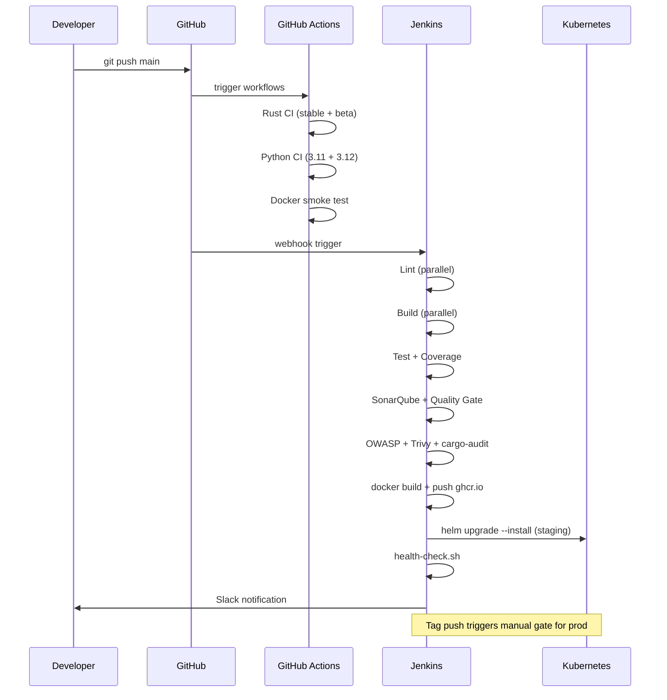

# Architecture

This document describes the full architecture of the **Integration Project** — a multi-language CI/CD platform demonstrating production-grade DevOps practices across Python, Rust, Docker, Kubernetes, and Jenkins.

---

## System Overview

```mermaid
flowchart LR
    subgraph Developer["Developer Workflow"]
        A["Git Push / PR"] --> B["GitHub Actions"]
    end

    subgraph GHA["GitHub Actions (Parallel)"] 
        B --> C["Rust CI\n(stable + beta)"]
        B --> D["Python CI\n(3.11 + 3.12)"]
        B --> E["Integration Tests\n(daily + on-push)"]
    end

    subgraph Jenkins["Jenkins Pipeline (10 stages)"]
        F["1. Checkout"] --> G["2. Lint (parallel)\nPython + Rust + Helm"]
        G --> H["3. Build (parallel)\nPython + Rust"]
        H --> I["4. Test (parallel)\nPytest + cargo test"]
        I --> J["5. SonarQube Analysis"]
        J --> K["6. Quality Gate"]
        K --> L["7. Security (parallel)\nOWASP + Trivy FS + cargo-audit"]
        L --> M["8. Docker Build + Push\nghcr.io"]
        M --> N["9. Helm Deploy\n→ Staging"]
        N --> O["10. Manual Gate\n→ Production"]
    end

    subgraph K8s["Kubernetes Cluster"]
        P["flight-ingest\n(2–10 replicas HPA)"] 
        Q["Prometheus\nServiceMonitor"]
        R["PodDisruptionBudget\nminAvailable: 1"]
    end

    M --> K8s
    N --> P
    P --> Q
    B --> Jenkins
```

---

## Services

### `services/flight-ingest` (Python / FastAPI)

A real-time event ingestion microservice modelled on an airline operations feed.

| Endpoint | Method | Purpose |
|----------|--------|---------|
| `/healthz` | GET | Kubernetes liveness probe |
| `/readyz` | GET | Kubernetes readiness probe |
| `/metrics` | GET | Prometheus scrape endpoint |
| `/ingest` | POST | Accept a `FlightEvent` payload |
| `/events/summary` | GET | Aggregate summary (stub) |

**Metrics emitted:**
- `flight_ingest_requests_total{status, airline}` — counter
- `flight_ingest_duration_seconds` — histogram
- `flight_ingest_errors_total{error_type}` — counter

---

### `tools/log-parser` (Rust)

A zero-dependency CLI that parses Jenkins console output and produces structured failure reports.

```
log-parser --input build.log --format json --fail-on-error
```

Outputs:
```json
{
  "entries": [{"line_number": 42, "severity": "error", "message": "...", "stage": "Build"}],
  "test_summary": {"total": 10, "failures": 1, "errors": 0, "skipped": 0},
  "build_duration_seconds": 123.4,
  "stages": ["Checkout", "Build", "Test"]
}
```

---

## CI Pipeline Detail



---

## Security Layers

| Layer | Tool | What it checks |
|-------|------|----------------|
| Dependency vulnerabilities | `safety`, `cargo audit` | Known CVEs in Python + Rust deps |
| Container image CVEs | Trivy | OS + app layer vulnerabilities |
| Filesystem scan | Trivy FS | Secrets, misconfigs in repo |
| Static analysis | SonarQube | Code quality, security hotspots |
| Python security | Bandit | Common Python security antipatterns |
| Non-root container | Dockerfile | Runs as UID 1000, no privilege escalation |
| Read-only root FS | Helm values | `readOnlyRootFilesystem: true` |
